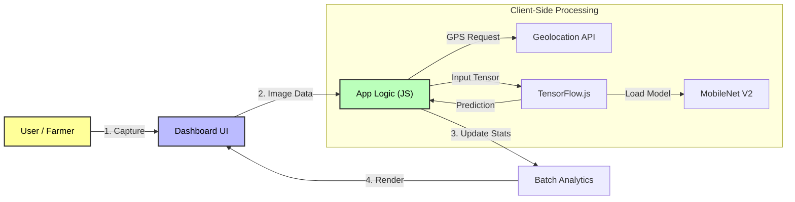

# Technical Architecture Document

## 1. System Overview
Grade-O-Meter is a client-side web application designed for offline inference. It utilizes a **Single Page Application (SPA)** architecture where the AI model is loaded directly into the browser's memory, eliminating latency and server costs.

## 2. Architectural Diagram

The following diagram illustrates the data flow from the user's device to the inference engine and back to the dashboard.

    

## 3. Data Flow
1.  **Input:** User captures image via Webcam or Upload.
2.  **Preprocessing:** Image is resized to 224x224 and normalized.
3.  **Inference:** TensorFlow.js runs the MobileNet model against the input.
4.  **Post-Processing:** The class with the highest probability (>80%) determines the Grade.
5.  **Logging:** The result, timestamp, and GPS coordinates are logged to the batch array.

## 4. Tech Stack
* **Frontend:** HTML5, CSS3, Bootstrap 5.
* **AI Framework:** TensorFlow.js (Client-side).
* **Model Architecture:** Transfer Learning on MobileNet.
* **Deployment:** GitHub Pages.
